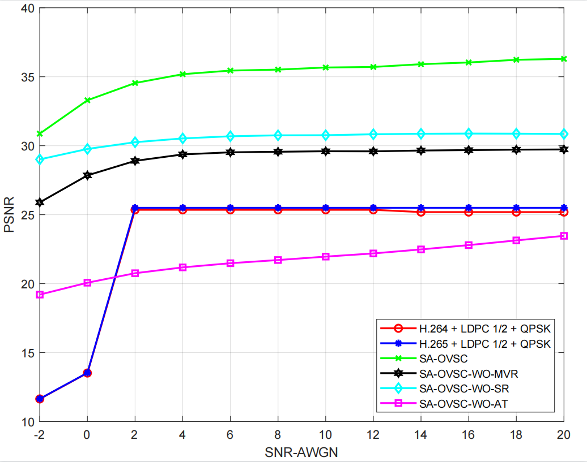
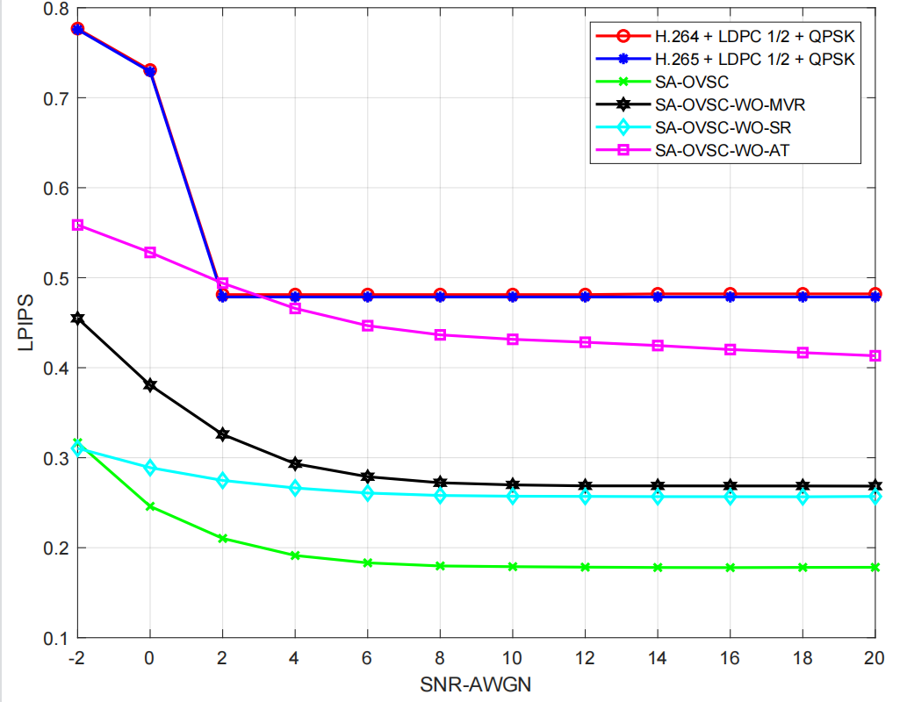
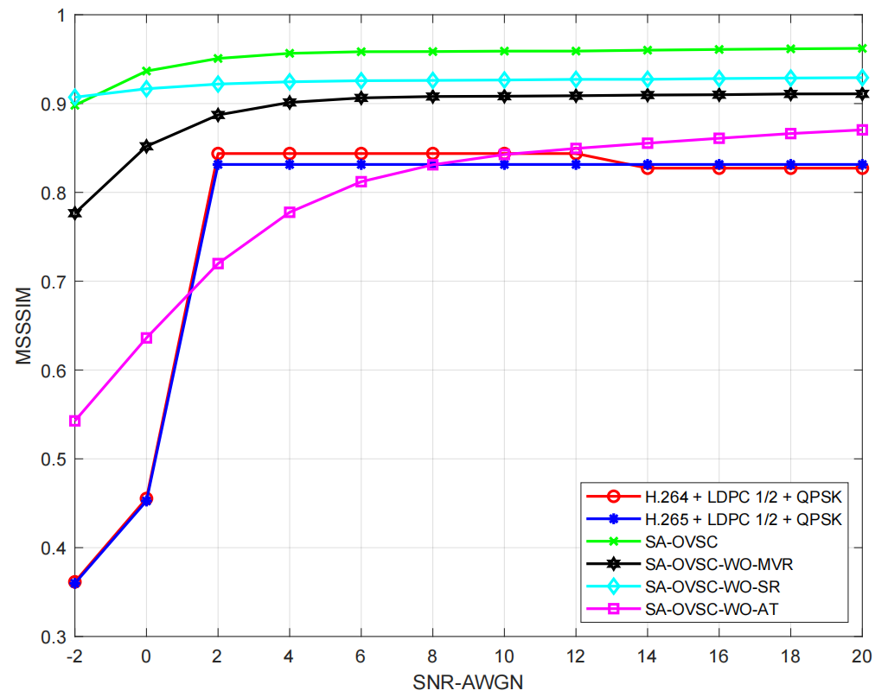
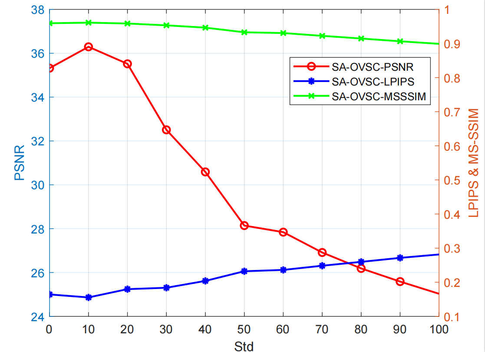

##The initial project of "A deep learning enabled video semantic transmission against multi-dimensional noise";

### result

- PSNR

- LPIPS
  
  

- MS-SSIM
  
  

- metrics as the Std increasing
  
  

## Key Dependency

- pytorch==1.10
- pytorch-msssim==0.2.1
- scikit-image==0.16.2
- lpips==0.1.4

 
